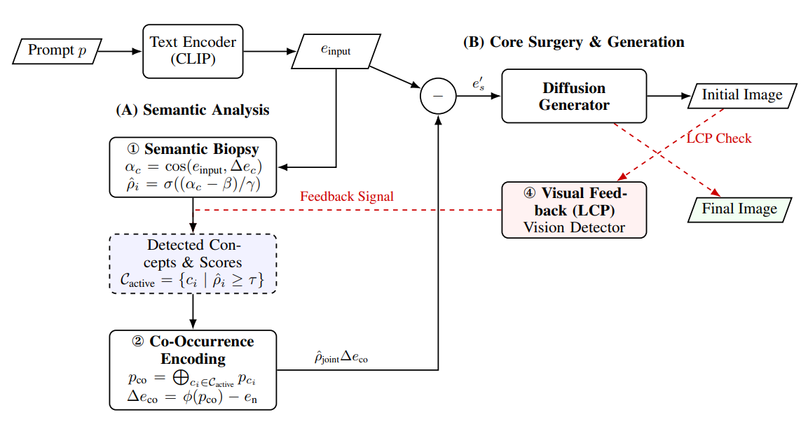

# Semantic Surgery: Zero-Shot Concept Erasure in Diffusion Models

This repository is the official PyTorch implementation of the paper: **"Semantic Surgery: Zero-Shot Concept Erasure in Diffusion Models" (NeurIPS 2025)**.

<p align="center">
  
</p>

## Abstract

With the growing power of text-to-image diffusion models, their potential to generate harmful or biased content has become a pressing concern. Existing concept erasure techniques often compromise generative capabilities or lack robustness. Here, we introduce **Semantic Surgery**, a novel training-free framework for zero-shot concept erasure that operates directly on text embeddings before the diffusion process. Our method dynamically estimates the presence of target concepts in a prompt and performs a calibrated vector subtraction to neutralize their influence at the source. The framework includes a Co-Occurrence Encoding module for robust multi-concept erasure and an optional visual feedback loop to address latent concept persistence (LCP). This pre-diffusion, semantics-aware design not only ensures precise, context-aware interventions without model retraining but also provides inherent resilience against adversarial attacks. Extensive experiments on object, style, and multi-concept erasure show our method significantly outperforms state-of-the-art approaches in completeness, locality, and general image quality (e.g., achieving a 93.58 H-score in object erasure and an 8.09 $H_a$ in style erasure with no FID/CLIP degradation). Crucially, on safety-critical tasks, it reduces explicit content to a single instance and demonstrates exceptional adversarial robustness, achieving a 0.0\% success rate against white-box attacks. This resilience further enables our framework to function as a built-in threat detection system by monitoring concept presence scores, offering a highly effective and practical solution for safer text-to-image generation.

## Requirements

To set up the environment, please install the required packages:

```bash
pip install -r requirements.txt
```

This will install all necessary dependencies listed in the `requirements.txt` file located in the root directory of this repository.

## Inference

This section explains how to generate images with specific concepts erased using Semantic Surgery.

### 1. Configuration

Inference is controlled via a JSON configuration file. An example `config.json` is provided below and should be adapted to your specific needs:

```json
{
    "diffuser": {
    "scheduler": "DDIM", // Scheduler type (e.g., "DDIM", "LMSDiscrete")
    "concepts_to_erase": ["car"], // List of concepts to erase
    "neutral_concept": "", // Optional: A neutral concept for guidance
    "params": { // Parameters for Semantic Surgery
        "gamma": 0.02,    // Sigmoid steepness
        "beta": -0.06,    // Concept presence threshold offset
        "alpha_f": null,  // (Advanced) Custom alpha function path
        "erase_index_f": null, // (Advanced) Custom erase index function path
        "lambda": 1.0, // Weight for LCP visual feedback (if detector is used)
        "alpha_threshold": 0.5     // Detection threshold for LCP visual feedback
    },
    "device": "cuda:0" // Device for inference
    },
    "detector": { // Optional: Configuration for the LCP visual feedback detector
    "type": "ConcurrentObjectDetection", // "NudeDetection", "ConcurrentObjectDetection", or "custom"
    "params": { // Parameters specific to the chosen detector type
        "threshold": 0.5, // Detection threshold for AOD
        "concepts": ["car"], // Concepts for AOD to detect (should match/relate to concepts_to_erase)
        "api_key_pool": ["YOUR_LANDINGAI_AOD_API_KEY_HERE"], // Replace with your Landing AI AOD API key(s)
        "url": "https://api.va.landing.ai/v1/tools/agentic-object-detection",
        "max_workers": 2 // Max concurrent API calls for AOD
    }
    },
    "generation": {
    "prompts_path": "./prompts/example_prompts.csv", // Path to a CSV file with prompts
    "save_folder": "./output_images", // Folder to save generated images
    "guidance_scale": 7.5, // Classifier-free guidance scale
    "image_size": 512,     // Size of generated images
    "ddim_steps": 50,      // Number of DDIM steps
    "num_samples": 1,      // Number of images to generate per prompt
    "use_cuda_generator": false, // Use CUDA generator for reproducibility
    "specify_classes": null, // Optional: "class1:num1,class2:num2" to generate specific numbers for certain classes
    "log_interval": 10,     // Logging interval
    "show_alpha": false,   // (Debug) Show alpha values during generation
    "use_safety_checker": false // Use the model's default safety checker
    }
}
```

**Key Configuration Points:**

*   **`diffuser.concepts_to_erase`**: List the concepts you want to remove (e.g., `["dog", "cat"]`).
*   **`diffuser.params`**:
    *   `beta` (concept presence threshold offset) and `gamma` (sigmoid steepness) are core parameters for the initial semantic surgery.
    *   `alpha_threshold` (e.g., 0.5): This is the $\tau$ from the paper. It's the semantic confidence threshold for a concept to be considered present and targeted for erasure by the initial surgery.
    *   `lambda` (e.g., 1.0): This is the $\lambda_{vis}$ from the paper. It's the scaling factor for the visual feedback adjustment from the LCP module. It controls the strength of the correction based on detector output.
*   **`detector`**: If you want to use the Latent Concept Persistence (LCP) mitigation with visual feedback, configure the appropriate detector.
    *   **AOD for Object Erasure**: The `ConcurrentObjectDetection` type uses Landing AI's AOD and is provided as an example for object-based LCP feedback. To use it, you must obtain your own API key and insert it into the `api_key_pool`.
    *   **NudeNet for Explicit Content Removal**: The `NudeDetection` type is used for the I2P task. The configuration for this can be found in `config/i2p.json`. This detector is implemented locally and does not require an API key. The core logic is in `src/detection_nude.py`.
    *   Set `detector` to `null` or remove the section if you don't want to use LCP.
*   **`generation.prompts_path`**: Path to a CSV file. The CSV should have at least a `prompt` column. It can also have `evaluation_seed` and `case_number` columns for systematic evaluation (see `SS_inference.py` for details on format).
*   **`generation.save_folder`**: Directory where generated images will be saved.


### 2. Running Inference

Once your configuration file (e.g., `my_config.json`) is ready, run the inference script:

```bash
python inference_cli.py --config path/to/your/my_config.json
```

Generated images will be saved in the `save_folder` specified in your configuration. The script supports checkpointing, so if it's interrupted, it can resume from the last completed prompt.

### 3. Try jupyter notebook demo
You can also use the notebook `./inference_demo.ipynb` to quickly generate examples and compare with the original generated image. This provides a interactive experience to help you to better understand our Semantic Surgery through quick examples. 

## Metrics Evaluation

We provide scripts to evaluate the performance of concept erasure based on various metrics. The evaluation scripts for FID, CLIP Score, NudeNet detection, and GCD are similar to those used in MACE and other related works.

**General Setup:**

*   Ensure your generated images are in a specified folder.
*   Activate the correct Conda environment if necessary (e.g., for GCD).

---

### 1. Evaluate Object Erasure Accuracy (Official Method)

For the official, unbiased evaluation of object erasure ($Acc_E, Acc_R, Acc_L$), we use the local, open-source **Owl-ViT** detector.

**Script:** `evaluation/eval_owl_vit.py`

**Command:**
```bash
python evaluation/eval_owl_vit.py \
    --folder_path 'path/to/your/generated/images' \
    --prompts_path 'path/to/your/prompts.csv' \
    --eval_result_path './results/owlvit_accuracy.csv' \
    --detection_result_path './results/owlvit_detections.csv' \
    --erased_concept 'the_erased_concept'
```

---

### 2. Evaluate FID (Fréchet Inception Distance)

Measures the similarity between the distribution of generated images and a reference dataset (e.g., COCO ground truth) using [clean-fid](https://github.com/GaParmar/clean-fid).

**Script:** `evaluation/evaluate_fid.py`

**Command:**

```bash
CUDA_VISIBLE_DEVICES=0 python evaluation/evaluate_fid.py \
    --dir1 'path/to/your/generated/image/folder' \
    --dir2 'path/to/reference_dataset/images_folder' # e.g., COCO validation set
```

---

### 3. Evaluate CLIP Score

Measures the semantic similarity between generated images and their corresponding input prompts using [CLIP](https://github.com/openai/CLIP).

**Script:** `evaluation/evaluate_clip_score.py`

**Command:**

```bash
CUDA_VISIBLE_DEVICES=0 python evaluation/evaluate_clip_score.py \
    --image_dir 'path/to/your/generated/image/folder' \
    --prompts_path 'path/to/your/prompts.csv' # CSV file with prompts corresponding to images
```
*   Ensure the `prompts.csv` file has a column (e.g., `prompt`) containing the text prompts. The script will match images to prompts based on filenames or an assumed order.

---

### 4. Evaluate Nudity Detection (e.g., for Explicit Content Removal)

Uses NudeNet to detect the presence of nudity in generated images.

**Script:** `evaluation/evaluate_by_nudenet.py`

**Prerequisites:**

*   Install NudeNet: Follow the official NudeNet installation guidelines. For results comparable to some papers, a detection threshold around 0.6 is often used.
*   The script may require adjustment of an internal detection `threshold` to replicate paper results. You can also refer to the setup in the [MACE repository](https://github.com/Shilin-LU/MACE) which we adopt from. 

**Command:**

```bash
CUDA_VISIBLE_DEVICES=0 python evaluation/evaluate_by_nudenet.py \
    'path/to/your/generated/image/folder' \
    --output './results/nudity_detections.csv' \
    --cache './cache/nudenet_cache.json'
```

*   The first argument is the `folder_path`.
*   `--output`: Specifies the path for the output CSV file detailing detections.
*   `--cache`: Specifies the path for the cache file to speed up reprocessing.


---

### 5. Evaluate GCD (Generalized Concept Detection) Accuracy

Used for detecting general concepts, often for evaluating style or celebrity erasure.

**Script:** `evaluation/evaluate_by_GCD.py`

**Prerequisites:**

*   Install GCD: Follow the [official GCD installation guidelines](https://github.com/Giphy/celeb-detection-oss/tree/master/examples).
*   Activate the GCD conda environment: `conda activate GCD` (or as per your GCD setup).
*   Ensure the input image folder contains only images directly, not in subdirectories.

**Command:**

```bash
# First, activate the GCD environment if needed
# conda activate GCD

CUDA_VISIBLE_DEVICES=0 python evaluation/evaluate_by_GCD.py \
    --image_folder 'path/to/your/generated/image/folder'
```

### 6. Evaluate Adversarial Robustness

To reproduce our adversarial attack experiments, follow these two steps:

**Prompts:** `prompts_csv/rab_adversarial_prompts.csv`
**Config for Generation:** `config/ring_a_bell_no_detector.json`

**Step 1: Generate Images**
```bash
python src/Inference_cli.py --config config/ring_a_bell_no_detector.json
```

**Step 2: Evaluate Attack Success Rate (ASR)**
This script uses NudeNet to calculate the percentage of generated images that successfully bypass the erasure.

**Script:** `evaluation/eval_ASR.py`

**Command:**
```bash
python evaluation/eval_ASR.py ./output/ring_a_bell_no_detector
```
The script will print the ASR and save detailed reports in the output folder.

## Assumption Verification(Empirical Support for $\alpha_c$-Separability)

Details of verification could be found in `assumption_verify.ipynb`. In addition to being used as a hypothesis validation, this method also works well as a tuning process to find a suitable $\beta$ value.

## Citation

If you find our work useful for your research, please consider citing our paper:

```bibtex
@inproceedings{xiong2025semanticsurgery,
  title={Semantic Surgery: Zero-Shot Concept Erasure in Diffusion Models},
  author={Xiong, Lexiang and Liu, Chengyu and Ye, Jingwen and Liu, Yan and Xu, Yuecong},
  booktitle={Advances in Neural Information Processing Systems},
  year={2025}
}

```

## Acknowledgements

Our implementation has benefited from the public codebases of previous works in concept erasure. We extend our gratitude to the authors of the following projects for making their code available:

*   **[MACE: Mass Concept Erasure in Diffusion Models](https://github.com/Shilin-LU/MACE)**: Our evaluation scripts for metrics such as FID, CLIP Score, and GCD are adapted from their repository.
*   **[Erasing Concepts from Diffusion Models (ESD)](https://github.com/rohitgandikota/erasing)**: We referred to their implementation for insights into model handling and experimental setups.

Their contributions have been invaluable to our research and the broader community.